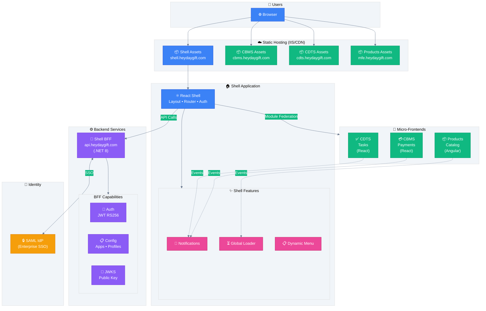
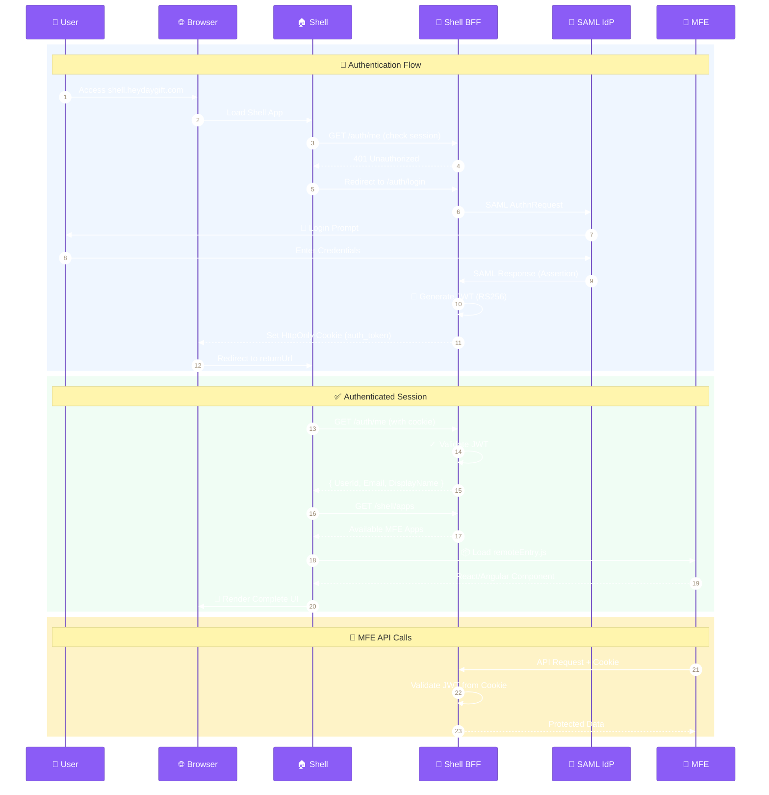
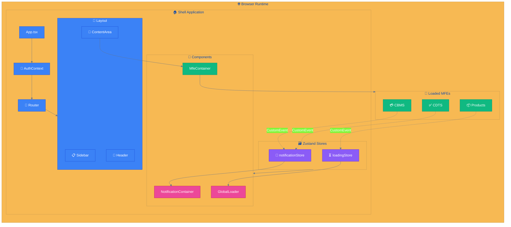
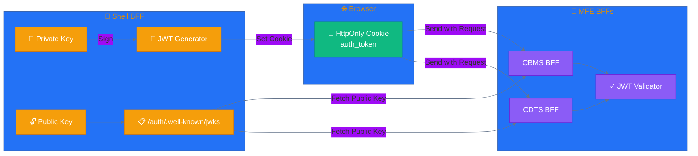
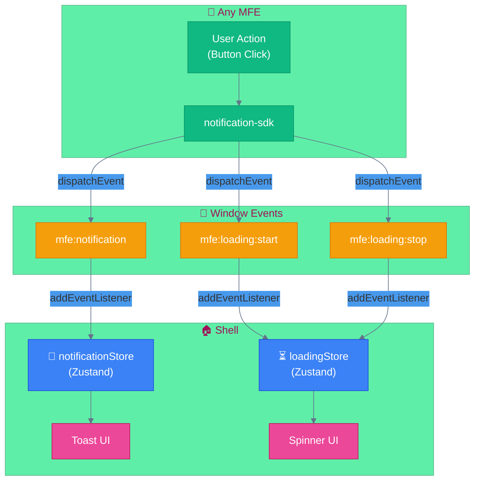

# 🏗️ MFE Platform Architecture

> Enterprise Micro-Frontend Platform with Module Federation, Cookie-based JWT Authentication, and Cross-MFE Communication

---

## 📊 High-Level Architecture



---

## 🔐 Authentication Flow



---

## 🧱 Shell Component Architecture



---

## 🔑 JWT Token Flow



---

## 📡 Cross-MFE Communication



---

## 🗂️ Project Structure

```
mfe/
├── 📁 apps/
│   ├── 🏠 shell/              # Host application
│   │   ├── src/
│   │   │   ├── App.tsx
│   │   │   ├── AuthContext.tsx
│   │   │   ├── api.ts
│   │   │   ├── stores/        # Zustand stores
│   │   │   └── components/    # Shell components
│   │   └── vite.config.ts
│   │
│   ├── 💳 cbms/               # Payments MFE (React)
│   │   ├── src/
│   │   │   ├── CbmsApp.tsx
│   │   │   └── cbms.css
│   │   └── vite.config.js
│   │
│   ├── ✅ cdts/               # Tasks MFE (React)
│   │   ├── src/
│   │   │   ├── CdtsApp.tsx
│   │   │   └── cdts.css
│   │   └── vite.config.js
│   │
│   └── 📦 mfe-products-angular/  # Products MFE (Angular)
│       ├── src/
│       └── vite.config.mts
│
├── 📁 backend/
│   └── 🔌 shell-bff/          # .NET 8 API
│       ├── Program.cs
│       ├── AuthEndpoints.cs
│       ├── ShellEndpoints.cs
│       ├── JwtService.cs
│       └── appsettings.*.json
│
└── 📁 packages/
    ├── 🔧 build-tools/        # PostCSS MFE scoping
    └── 📢 notification-sdk/   # Cross-MFE events
```

---

## 🌐 Deployment URLs

| Component    | URL                            | Technology   |
| ------------ | ------------------------------ | ------------ |
| 🏠 Shell     | `https://shell.heydaygift.com` | React + Vite |
| 🔌 Shell BFF | `https://api.heydaygift.com`   | .NET 8       |
| 💳 CBMS      | `https://cbms.heydaygift.com`  | React + Vite |
| ✅ CDTS      | `https://cdts.heydaygift.com`  | React + Vite |
| 📦 Products  | `https://mfe.heydaygift.com`   | Angular      |

---

## 🔧 Key Technologies

| Layer                 | Technology                         | Purpose                              |
| --------------------- | ---------------------------------- | ------------------------------------ |
| **Module Federation** | `@originjs/vite-plugin-federation` | Dynamic MFE loading                  |
| **State Management**  | Zustand                            | Shell stores (notifications, loader) |
| **Authentication**    | JWT RS256 + HttpOnly Cookie        | Secure token handling                |
| **CSS Isolation**     | PostCSS `data-mfe` scoping         | Style encapsulation                  |
| **API Gateway**       | .NET 8 Minimal API                 | BFF pattern                          |
| **Identity**          | SAML 2.0                           | Enterprise SSO (future)              |

---

## 📋 API Endpoints

### Auth (`/auth/*`)

| Method | Endpoint                 | Description                   |
| ------ | ------------------------ | ----------------------------- |
| GET    | `/auth/login`            | Login page                    |
| POST   | `/auth/login`            | Process login, set JWT cookie |
| POST   | `/auth/logout`           | Clear auth cookie             |
| GET    | `/auth/me`               | Get current user              |
| GET    | `/auth/.well-known/jwks` | Public key for MFE BFFs       |

### Shell (`/shell/*`)

| Method | Endpoint          | Description                |
| ------ | ----------------- | -------------------------- |
| GET    | `/shell/apps`     | Available MFE applications |
| GET    | `/shell/profiles` | User profiles              |
| GET    | `/shell/menu`     | Dynamic sidebar menu       |

---

## 🚀 Quick Start

```bash
# Install dependencies
npm install

# Start all apps (dev mode)
npm run dev

# Build for production
npm run build

# Start Shell BFF
cd backend/shell-bff && dotnet run
```

---

## 🔒 Security Highlights

- ✅ **HttpOnly Cookies** - JWT not accessible via JavaScript
- ✅ **RS256 Asymmetric Keys** - Private key stays in Shell BFF only
- ✅ **SameSite=None + Secure** - Cross-origin cookie support
- ✅ **CORS Configured** - Shell origin whitelisted on MFEs
- ✅ **CSS Isolation** - No style bleeding between MFEs
